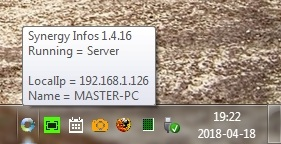
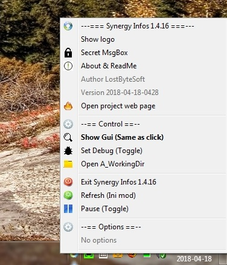
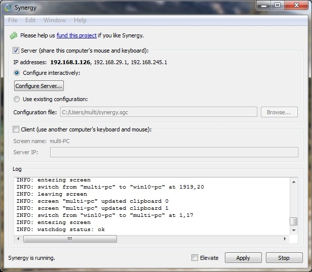

# synergy-1.4-infos-tray-bar (extended version of synergy error for version 1.3)

For use with synergy-1.4.16-r1969-Windows-x64.exe (or other 1.4 versions)

I change to version 1.4 for compatibility with linux and win10

Shoy an icon in the tray bar with options :

Thera are NO tray icon visible in version 1.4 so i made one ...
